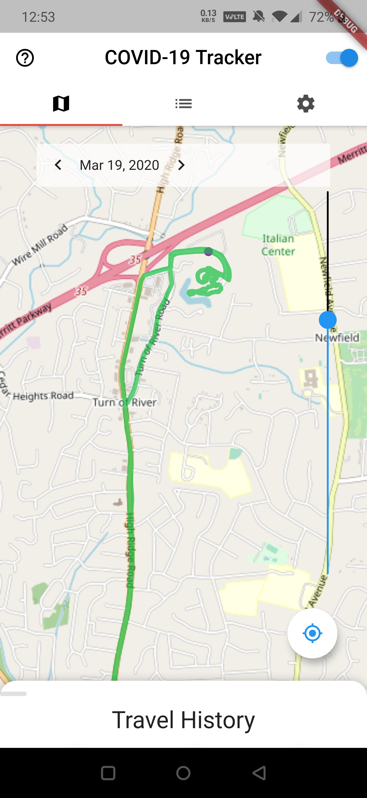
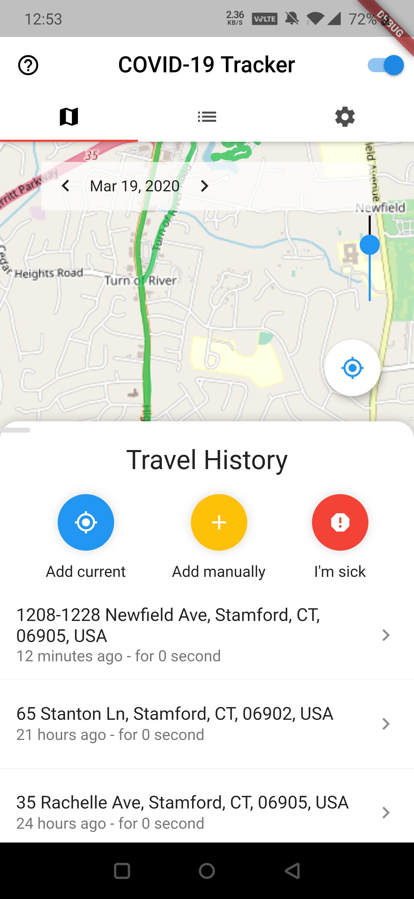
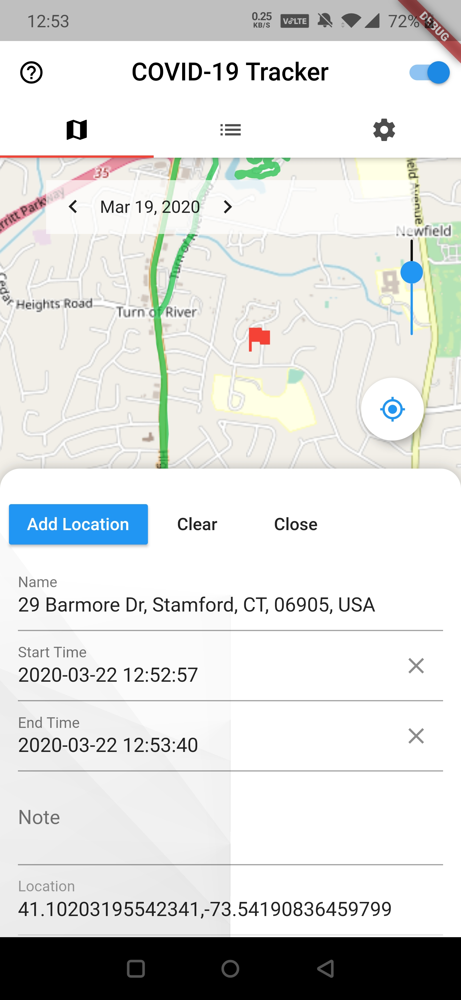
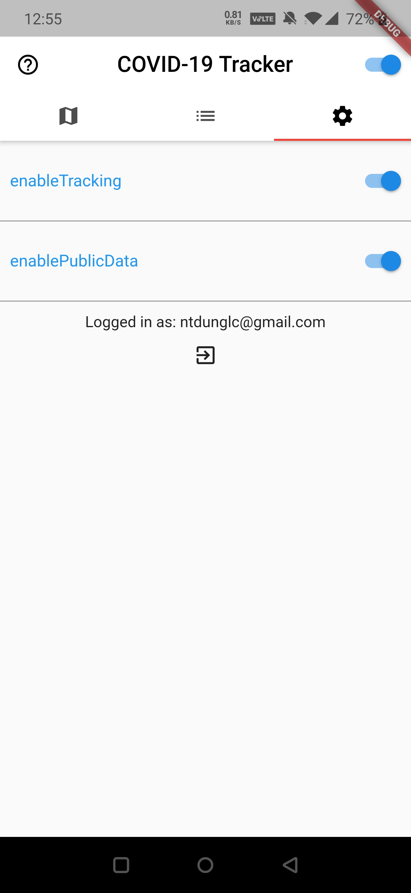
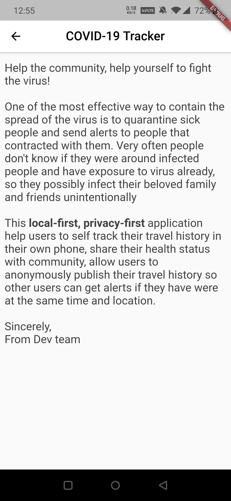

# covid19tracker

A Flutter app to allow users to track their location and travel history locally in ther phone and share anonymously with other users when they are sick, or have symtoms.

## Screenshots

